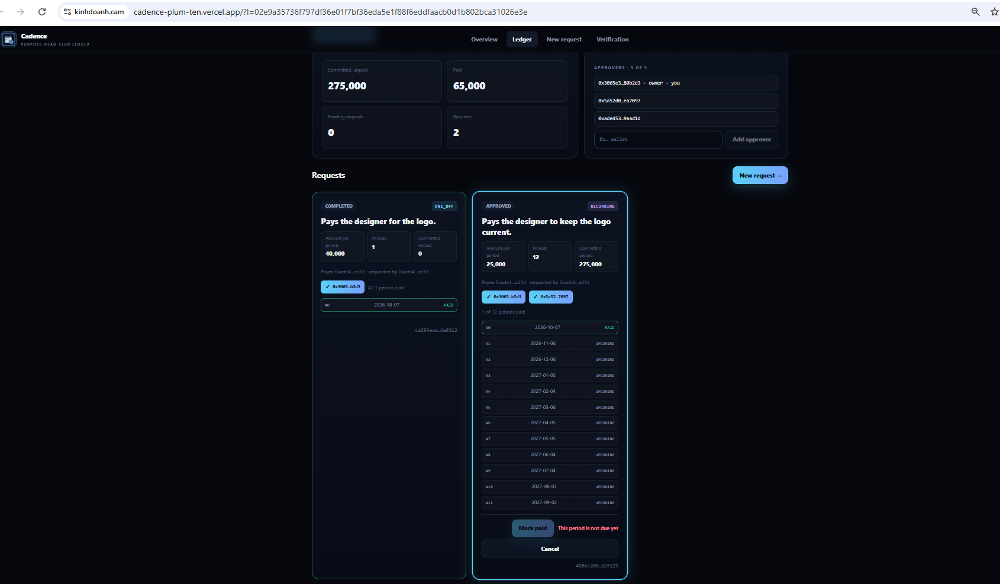

Cadence does not move money, and it does not judge whether a cost is worth paying. It reads what each payment is for, once, to tell an ongoing cost from a one-time one — and an ongoing cost needs two approvers and becomes a schedule, not a single line.

<p align="center"></p>

# Cadence

A club ledger whose sign-off follows the purpose of each payment, read by GenLayer validators. GenLayer StudioNet
(chain 61999) · py-genlayer v0.2.

**The contract holds no money.** It keeps ledgers, their approvers, payment requests with how each purpose was read,
and a schedule of periods to mark paid. Amounts are whole numbers in the ledger's smallest unit.

| | |
|---|---|
| Contract source | `contracts/Recurs.py` (SHA-256 in `SOURCE_SHA256.txt`) |
| Project deployment | [`0x95F3EDaaa83bf9BD16ded36528c9C8312329CB94`](https://explorer-studio.genlayer.com/address/0x95F3EDaaa83bf9BD16ded36528c9C8312329CB94) |
| Intelligent Contract | Recurs — the same frozen source, deployed separately at [`0x6be268aF6f1eE0179b5d8828191Cde9C46Afde0e`](https://explorer-studio.genlayer.com/address/0x6be268aF6f1eE0179b5d8828191Cde9C46Afde0e) |
| Live app | https://cadence-plum-ten.vercel.app |
| Evidence | `RUNTIME_EVIDENCE.md` (one tx hash per row) · `TESTING.md` |

## What it does

A club opens a ledger and names its approvers (up to five, the owner included). Anyone may request a payment: payee,
amount per period, how many periods, and the purpose in one line. Validators read the purpose **once** and decide one
thing:

| | `RECURRING` | `ONE_OFF` |
|---|---|---|
| Meaning | an ongoing cost | a one-time cost |
| Approvals needed | **2** (never the requester) | **1** (never the requester) |
| On approval | the declared periods, 30 days apart | **one** period, whatever was declared |

Period 0 falls due on the approval day and period k 30 × k days later; only the owner marks a period paid, and only once
it is due. On StudioNet, "Pays the designer to keep the logo current." was read **RECURRING** (two signatures, twelve
periods) and "Pays the designer for the logo." **ONE_OFF** (one signature, one period although twelve were declared) —
both on the Intelligent Contract and again through this app.



Unclear readings count as ONE_OFF, so nothing becomes a standing commitment on a guess.

## What the app shows

- **Overview**: how the reading sets the sign-off and the schedule.
- **Ledger**: the ledger's totals (committed and unpaid, paid, pending, requests), its approvers (the owner can add
  more), and every request as a card — purpose, RECURRING or ONE_OFF, amount, periods, signature slots filled with the
  approvers who signed, and the schedule with each period's date marked PAID, DUE or UPCOMING. *Approve*, *Mark period k
  paid* and *Cancel* appear for the wallets allowed to use them and are disabled with the contract's own sentence
  otherwise — the requester sees "You cannot approve your own request". A new ledger can be opened at the bottom.
- **New request**: payee, amount, periods and purpose, with what each reading would mean and the request id shown
  before you sign.
- **Verification**: contract address, source SHA-256, the rubric hash and the approval rule read from `get_limits`.

After every write the app waits for consensus to accept it, re-reads the ledger, and only then reports what happened —
for a request, how validators read the purpose and what it now needs.

## How to try it

You need **three wallets** on GenLayer StudioNet: owner, a second approver, and a requester. Only fees are spent.

1. **Owner** — open a ledger, add the two other wallets as approvers, copy the ledger link.
2. **Requester** — *New request*: amount `25000`, periods `12`, purpose `Pays the designer to keep the logo current.` →
   RECURRING, needs 2. Then `Pays the designer for the logo.` → ONE_OFF, needs 1 and one period. On your own request
   *Approve* is disabled with "You cannot approve your own request".
3. **Owner** and **second approver** — approve the recurring request: it becomes 12 periods; the owner marks period 0
   paid. Period 1 is not due for 30 days.

## Methods

| Write | Who | Checks, in order |
|---|---|---|
| `open_ledger(name)` | anyone (becomes the owner) | name 1–60 → not opened before |
| `add_approver(ledger_id, wallet)` | the owner | owner → valid wallet → not already → fewer than 5 |
| `request(ledger_id, payee, amount, periods, purpose)` | anyone | payee → amount 1–10^12 → periods 1–12 → purpose 1–100 → no reserved token → ledger not full → not requested before → **the only model call** |
| `approve(request_id)` | an approver, not the requester | PENDING → approver → not the requester → once |
| `mark_paid(request_id, k)` | the owner | APPROVED → owner → period exists → due → not paid |
| `cancel(request_id)` | requester or owner | PENDING or APPROVED → requester or owner |

Views return JSON strings with amounts as decimal strings: `get_ledger`, `get_request`, `get_ledger_requests`,
`get_rubric`, `get_limits`. The full specification is in `LOCKED_SPEC.md`.

## Run locally

```bash
npm ci
npm run dev            # http://localhost:5173 (the /genlayer-rpc proxy is in vite.config.ts)
npm run build && npm test
npm run verify:source
python3 -m pytest tests/contract -q -p no:cacheprovider   # needs genlayer-test 0.29.2
```

`VITE_CONTRACT_ADDRESS` overrides the deployment address. On Vercel, `vercel.json` declares the same proxy.

## Honest limitation

1. **A ledger, not a payment rail.** Marking a period paid records it; it moves nothing.
2. **The purpose is the requester's own words.** A purpose that hides a standing cost behind one-time wording can be
   read ONE_OFF; the approvers still see it and decide whether to sign.
3. **A wrong RECURRING is the main risk** — a one-time cost becomes a schedule. Nets: unclear output is ONE_OFF, and a
   RECURRING request needs two signatures from people other than the requester.
4. **Days come from the transaction's time** (UTC), not the club's calendar.
5. **Purposes with many non-ASCII characters** can pass the 255-byte calldata limit; the byte meter stops them.

License: MIT.
