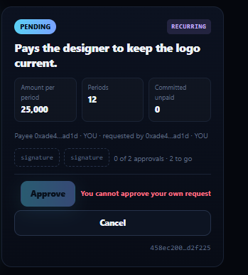
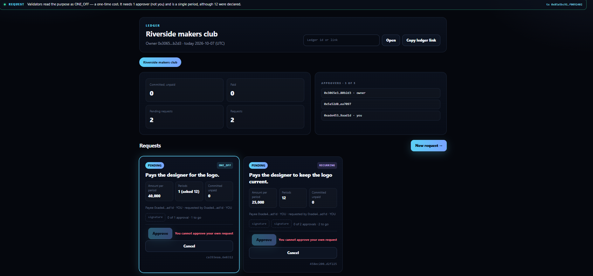
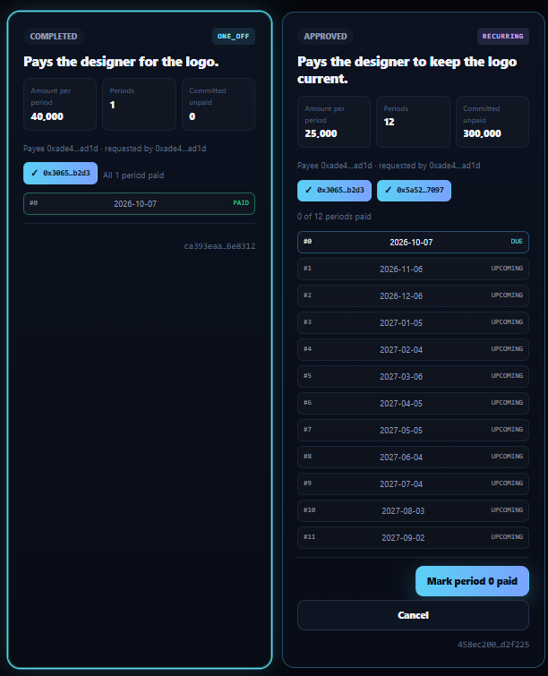

# RUNTIME_EVIDENCE

```
COMPILE PASS ≠ RUNTIME PASS
SUBMITTED ≠ ACCEPTED ≠ FINALIZED ≠ EXECUTION SUCCESS ≠ POSTCONDITION PASS
```

Both deployments run the same frozen source, SHA-256 `e16d5c3f290ee0deb644e6d301130a4ea757ad7bead058e6a43a0317ca992fa1`.

## Project run (address `0x95F3EDaaa83bf9BD16ded36528c9C8312329CB94`, through this app)

Run date 2026-10-07 (UTC day 20733), app at https://cadence-plum-ten.vercel.app, MetaMask on StudioNet. Deploy tx [`0x64345e21…1d87cca8`](https://explorer-studio.genlayer.com/tx/0x64345e2189d4e8c3f4c5cbfcfa7b5300efc4c566ad45a4c2facad3d71d87cca8). **10 transactions** sent from the app, all FINALIZED with SUCCESS.

Wallets: **A** = owner `0x3065E31B1D993d7C0D59E6786844cBa56780B2d3` · **B** = approver `0x5a52d040581A76e2C032542855D31480f2ea7097` · **C** = requester (also an approver) `0xADE4533b5C00Fc6c8E44F674213c081D919aaD1D`.
Ledger "Riverside makers club": `02e9a35736f797df36e01f7bf36eda5e1f88f6eddfaacb0d1b802bca31026e3e` — open it at https://cadence-plum-ten.vercel.app/?l=02e9a35736f797df36e01f7bf36eda5e1f88f6eddfaacb0d1b802bca31026e3e.

| # | Wallet | Action in the app | Tx hash | Result (read back by the app from the accepted state) |
|---|---|---|---|---|
| P1 | A | Open ledger `Riverside makers club` | [`0xa89f1d3d…8607cade`](https://explorer-studio.genlayer.com/tx/0xa89f1d3df50dd534353ad5a364bc80901865ede13c864432d577612a8607cade) | ledger open, A owner and first approver (the RPC dropped the read-back once; the app then showed "This ledger already exists" and the ledger was opened by id) |
| P2 | A | Add B, then C as approvers | [`0x136b22c3…676a5035`](https://explorer-studio.genlayer.com/tx/0x136b22c3f4b35ccfe045cb55561d669dd85f74e77deb9de1e32c868c676a5035) ; [`0xf1630747…740a24df`](https://explorer-studio.genlayer.com/tx/0xf1630747387ba5ab50cc40fc646705e6959cb2768acd01e2703ab78c740a24df) | Approvers 3 of 5 |
| P3 | C | Request 25,000 × 12 — `Pays the designer to keep the logo current.` | [`0xd52a06d1…eb4d40fd`](https://explorer-studio.genlayer.com/tx/0xd52a06d171e99f74dae843a76ab1f400bdd71728106bc1c4e7ad3cd5eb4d40fd) | **RECURRING** — needs 2 approvers, becomes 12 periods 30 days apart |
| P4 | C | Request 40,000 × 12 — `Pays the designer for the logo.` | [`0x85a5bc91…f0092402`](https://explorer-studio.genlayer.com/tx/0x85a5bc9165895c3beb04cba5397c02c4b9ecb57a9013ff1f2b3e94d0f0092402) | **ONE_OFF** — needs 1 approver, one period although 12 were declared ("1 (asked 12)") |
| P5 | C | Own requests in the ledger | — (not sent) | *Approve* disabled with *You cannot approve your own request* on both (screenshot 2) |
| P6 | A | Approve the recurring request | [`0xa04b1a47…67447cf8`](https://explorer-studio.genlayer.com/tx/0xa04b1a478ee9a9ccbf5a6c3fcef669d60392753793cb2dc4fb7d873067447cf8) | 1 of 2 approvals; A then sees *You have already approved this request* |
| P7 | A | Approve the one-off request | [`0xecf25094…04a9bb89`](https://explorer-studio.genlayer.com/tx/0xecf25094c10b025a464a336cd35691439ae1f3f661795d61c6a860f404a9bb89) | APPROVED with one approval, 1 period due 2026-10-07 |
| P8 | B | Approve the recurring request | [`0xa495b825…09388452`](https://explorer-studio.genlayer.com/tx/0xa495b825463e598638d2bd4edde9b86c829ec712d7bf03473a4892ee09388452) | **APPROVED, 12 periods**: #0 due 2026-10-07, #1 2026-11-06 … #11 2027-09-02 (screenshot 4) |
| P9 | A | Mark period 0 of the one-off request paid | [`0xff299806…9c718ea3`](https://explorer-studio.genlayer.com/tx/0xff299806a88a1991e4fffbe949e576d58603ed0f57a6fcb0f128f3119c718ea3) | COMPLETED — its single period paid |
| P10 | A | Mark period 0 of the recurring request paid | [`0xe31e4389…57c17e7d`](https://explorer-studio.genlayer.com/tx/0xe31e43890577e17f4976eb0641e4ed3b9daaa8328e9d50c8089d425b57c17e7d) | 1 of 12 paid; *Mark paid* then disabled with *This period is not due yet* |
| P11 | — | The ledger | — (read) | Committed, unpaid **275,000** (11 × 25,000) · Paid **65,000** (40,000 + 25,000) · Pending **0** · Requests 2 (screenshot 1) |

One purpose about the same designer and the same logo was read RECURRING and needed two signatures and a 12-period
schedule; the other was read ONE_OFF and needed one signature and one period. The app reported every write only after
re-reading the ledger and the request (`src/lib/verify.ts`).

Screenshots:








## Intelligent Contract run (address `0x6be268aF6f1eE0179b5d8828191Cde9C46Afde0e`, Studio)

Wallets: **A** = ledger owner `0x3065E31B1D993d7C0D59E6786844cBa56780B2d3` · **B** = approver `0xdaE8968571C6E84f44F86d06F1071bbc8F807500` · **C** = requester `0x579265b5718049eC4D07EED310C86E308B6d9AE1` (also an approver, so that row 5 reaches the own-request rule). Contract [`0x6be268aF6f1eE0179b5d8828191Cde9C46Afde0e`](https://explorer-studio.genlayer.com/address/0x6be268aF6f1eE0179b5d8828191Cde9C46Afde0e) · deploy tx [`0xd2e192df…d76669c9`](https://explorer-studio.genlayer.com/tx/0xd2e192df62cdd6b20dadabd718feb392d6dc3787434860a7f33d4783d76669c9) · source SHA-256 `e16d5c3f290ee0deb644e6d301130a4ea757ad7bead058e6a43a0317ca992fa1`. Run date 2026-10-06 UTC (day 20732; every row ran on that UTC day), GenLayer Studio, Normal (Full Consensus).

Each purpose is judged on its own; the model never sees the amount, the declared periods, the ledger or any wallet. Periods are 30 days long, counted from the UTC date of the approving transaction; `today` and `due_day` are days since 1970-01-01, and `today_date` / `due_date` show the same day as YYYY-MM-DD. Wallet C is added as an approver in row 2 so that row 5 exercises the own-request rule: a requester who is not an approver is refused earlier, as a non-approver.

The table has 13 rows and 13 transactions, all FINALIZED (14 with the deploy).

Ids (keccak of owner and name, or of ledger, requester and purpose): L `02e9a35736f797df36e01f7bf36eda5e1f88f6eddfaacb0d1b802bca31026e3e` · REQ1 `3a57ef38ee0062fdb4a391f5e90d653551bf58c46656f4666e7a6dadc2b82f8e` · REQ2 `1e624ec89f892f074580e3981e845d940ad96918dcf9f61ff3f0e6048e332c9e` · REQ3 (R2) `df254e8d48cd10688107be9762e0300a0b45a7a0c739cc5417141f0d6a8affa7` · REQ4 (O2) `dd11ac74e407d7ca8298c38b0af5fbc5dffe7e392c2897cd99018a9128cb00c2`.

| # | Wallet | Call | Expected | Tx hash | Result |
|---|---|---|---|---|---|
| 1 | A / — | `open_ledger("Riverside makers club")` ; `get_ledger(L)` | ledger L open, approvers [A]; get_ledger(L) shows `today` (days since 1970-01-01) and `today_date` = today's UTC date — **Clock check** | [`0x9955076e…c73666d7`](https://explorer-studio.genlayer.com/tx/0x9955076ec815c72883dc7febd46aa23e1a92604eb03c760ac05e003fc73666d7) | SUCCESS; get_ledger(L): approvers [A], `today` **20732**, `today_date` **2026-10-06** (the UTC date of the run) |
| 2 | A | `add_approver(L, B)` ; `add_approver(L, C)` | three approvers: A, B, C | [`0x605f4db1…8930059a`](https://explorer-studio.genlayer.com/tx/0x605f4db1e20dfc46370c992a177598a67309590643032d4545b0fddb8930059a) ; [`0xa74d30c4…4899d2e5`](https://explorer-studio.genlayer.com/tx/0xa74d30c4e091f1638ad3c081e31d77f7d384bc6966b0f6ea19ca542a4899d2e5) | SUCCESS (both); approver_count 3: A, B, C |
| 3 | C | `request(L, C, 25000, 12, R1)` | RECURRING; needed 2; PENDING — **Check 1a** | [`0x2d8e5a2a…21c7c9e1`](https://explorer-studio.genlayer.com/tx/0x2d8e5a2aee7599f994f4056183ce1058a3a86915d6e8e7a62030385221c7c9e1) | **RECURRING**; needed 2, approvals_left 2, PENDING, periods_on_approval 12 |
| 4 | C | `request(L, C, 40000, 12, O1)` | ONE_OFF; needed 1; periods_on_approval 1 although 12 were declared — **Check 1b** | [`0xb9b12aaa…107b6141`](https://explorer-studio.genlayer.com/tx/0xb9b12aaa6dcc54b7674ad6e6b504127676474f5dd977fa25bb0d4d48107b6141) | **ONE_OFF**; needed 1, PENDING, periods_asked 12, **periods_on_approval 1** |
| 5 | C | `approve(REQ1)` | revert *You cannot approve your own request* | [`0x492db765…67bcb4af`](https://explorer-studio.genlayer.com/tx/0x492db7654e4add02df2331bf6391a427415aabbc73c11a010817674667bcb4af) | reverted, *You cannot approve your own request* |
| 6 | A | `approve(REQ1)` | approvals 1 of 2; REQ1 stays PENDING | [`0x3edb92d6…aca901c7`](https://explorer-studio.genlayer.com/tx/0x3edb92d6cd20eb9df25e5391341cd8de7e1ac96585d95b71d64d55e5aca901c7) | SUCCESS; approvals 1, approvals_left 1, approved_by [A], still PENDING |
| 7 | B | `approve(REQ1)` | REQ1 APPROVED, 12 periods; period 0 due today, period 1 due in 30 days — **Check 3a** | [`0x9f344eaa…e9722a23`](https://explorer-studio.genlayer.com/tx/0x9f344eaad07045e88d4956606ea49acc2b66276fda832badb43374a1e9722a23) | SUCCESS; **APPROVED**, approved_day 20732 (2026-10-06), periods 12; period 0 due 20732 (due true), period 1 due 20762 (2026-11-05, due false) … period 11 due 21062 (2027-09-01); committed_unpaid "300000" |
| 8 | A | `approve(REQ2)` | REQ2 APPROVED with one approval, 1 period | [`0x5ae8f5ad…97bb915d`](https://explorer-studio.genlayer.com/tx/0x5ae8f5adc327dc8c9e395a9faae1740e31bb3041b97141ae9d239a8a97bb915d) | SUCCESS; **APPROVED** with one approval, periods 1, period 0 due 20732; committed_unpaid "40000" |
| 9 | A | `mark_paid(REQ1, 1)` | revert *This period is not due yet* — **Check 3b** | [`0xc743208d…9fa7dede`](https://explorer-studio.genlayer.com/tx/0xc743208d14bec5ad27ee63b7d1d50529b2a0a2cce184fc29b6cd6e2f9fa7dede) | reverted, *This period is not due yet* |
| 10 | A | `mark_paid(REQ1, 0)` | REQ1 period 0 paid; paid_count 1 — **Check 3c** | [`0x10e066e4…47fecd06`](https://explorer-studio.genlayer.com/tx/0x10e066e484cf5df0391a84bdf0d2fc6ec78df5e23a9c762100bc33e647fecd06) | SUCCESS; period 0 of REQ1 paid, paid_count 1 |
| 11 | C | `request(L, C, 3000, 12, R2)` | RECURRING; needed 2 — **Check 2a** | [`0x3ae6379b…7abf518b`](https://explorer-studio.genlayer.com/tx/0x3ae6379b20292b2eb341e7974a3fdd042852c37b96193cd6dba622cf7abf518b) | **RECURRING**; needed 2 (sent after row 12, see notes) |
| 12 | C | `request(L, C, 90000, 12, O2)` | ONE_OFF; needed 1 — **Check 2b** | [`0x344c3ff6…d35bf337`](https://explorer-studio.genlayer.com/tx/0x344c3ff6c23d096f7b549e73a8c05a4d796f100b9fea51db1e0c0324d35bf337) | **ONE_OFF**; needed 1 |
| 13 | — | `get_ledger(L)` | read: committed_unpaid "315000" (11×25000 + 40000), paid_total "25000", pending_count 2 | — (read) | committed_unpaid **"315000"**, paid_total **"25000"**, pending_count **2**, request_count 4, today 20732 |

Must-verify rows:

- **Clock check** — get_ledger returns today's UTC date as `today` / `today_date` (row 1): **PASS**
- **Check 1** — R1 → RECURRING with 2 approvals needed; O1 → ONE_OFF with 1 approval needed and 1 period although 12 were declared (rows 3, 4): **PASS**
- **Check 2** — R2 → RECURRING and O2 → ONE_OFF (rows 11, 12): **PASS**
- **Check 3** — two approvals turn REQ1 into 12 periods; period 0 is due today and period 1 is not (rows 7, 9, 10): **PASS**

Notes from the run:

- Rows 11 and 12 were sent in swapped order (O2 first, then R2). Both are independent new requests, so the order changes nothing: each was read as expected and the ledger totals in row 13 match the plan.
